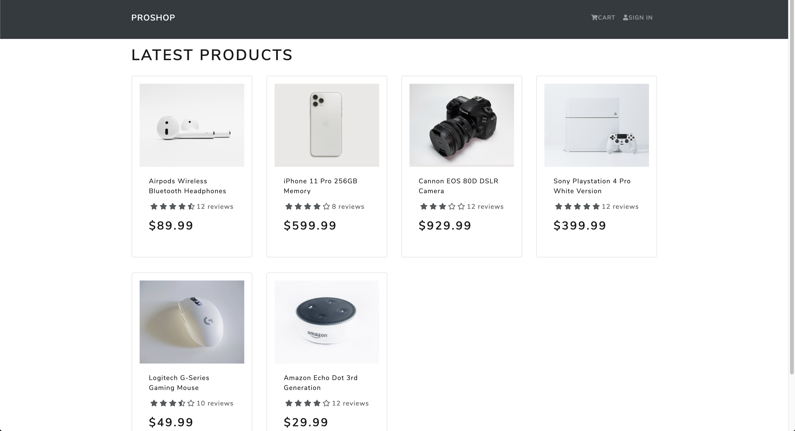

# Proshop

#### ⚠️Work in progress

### Configuration

Without creating a database in MongoDB Atlas the application won't work.

Steps to build the app:

- create a `.env` file in the root folder
- create a MongoDB Atlas database end copy the URI
- put inside the `.env`:
  - `NODE_ENV = development`
  - `PORT = 5000`
  - `MONGO_URI = {your mongo URI}`
- `npm install` on both the root and frontend folder
- `npm run dev`
